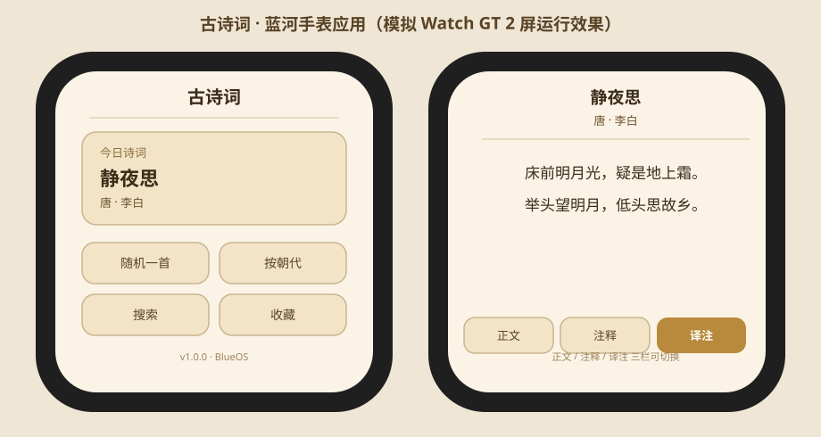

# 古诗词 · 蓝河智能手表应用（BlueOS / vivo Watch GT 2）

> 面向 **vivo Watch GT 2** 的古诗词查询 App，基于**蓝河操作系统（BlueOS）**开发，通过 **OrbitV** 平台分发安装到手表。

一个把「K12 必背古诗词」装进智能手表的小作品：离线可查、古风米黄主题、圆形表盘适配，既是练手项目，也能作为 BlueOS 应用开发 / 手表端轻量阅读器的参考实现。

---

## ✨ 功能特性

- 📚 **188 首 K12 必背诗词曲**：覆盖小学 / 初中 / 高中，含诗经、汉乐府、唐、宋、元、明、清、近代
- 📖 **三栏阅读**：`正文` / `注释`（字词句释义） / `译注`（译文 + 赏析）一键切换，竖排可选
- 🔍 **多入口浏览**：按朝代、按学段、关键词搜索、随机一首、每日一诗
- ❤️ **本地收藏**：基于 K-V 存储，刷新不丢
- 🎨 **古风米黄主题**：全局 `#FBF3E6` 暖色背景，适配 466×466 圆形表盘

---

## 🛠 技术栈

- **BlueOS（蓝河）应用框架**：类 Web 范式（`.ux` + JavaScript，MVVM 架构）
- **离线内置数据**：`src/data/poems.js`（JSON 数组，约 100KB，手表内存友好）
- **OrbitV 分发**：打包 RPK 后经蓝牙推送到 Watch GT 2
- **数据生成**：`scripts/crop_data.py` 可从 [chinese-poetry](https://github.com/chinese-poetry/chinese-poetry) 公开数据集裁剪生成

---

## 📂 目录结构

```
poetry-app/
├─ manifest.json              # 包名 / 路由 / deviceType(watch-round) / 设计宽 466
├─ src/                       # BlueOS 真机工程
│  ├─ app.ux                  # 全局样式（米黄背景）
│  ├─ data/poems.js           # 188 首诗词数据（含 zhushi 注释 / note 译注）
│  ├─ pages/                  # 6 个页面：首页 / 分类 / 列表 / 详情 / 搜索 / 收藏
│  ├─ utils/store.js          # 收藏 K-V 存储封装
│  └─ assets/images/logo.png  # 应用图标
├─ preview/                   # 浏览器高保真原型（可在线试玩，无需安装）
│  ├─ index.html              # 单文件交互原型，模拟手表屏
│  └─ poems-data.js           # 预览用数据（与真机同源）
├─ scripts/crop_data.py       # 从 chinese-poetry 生成数据
├─ simulator.js               # 真机逻辑模拟器（24 项断言，验证数据/路由/搜索/收藏）
├─ LICENSE
└─ README.md
```

---

## 📸 模拟运行效果

下图模拟 vivo Watch GT 2（466×466 屏）上的实际界面：左侧**首页**（今日诗词 / 随机 / 分类 / 搜索 / 收藏入口），右侧**详情页**（正文 / 注释 / 译注 三 Tab 切换，全局古风米黄 `#FBF3E6` 主题）。



## 🌐 在线体验（Web Demo）

无需安装，直接用浏览器打开 `preview/index.html` 即可体验完整交互（模拟 Watch GT 2 屏幕，含收藏持久化）。
仓库根目录另含 `index.html` 项目主页，可作为 GitHub Pages 落地页。

### 开启 GitHub Pages（让 Demo 在线可玩）
1. 仓库 `Settings → Pages`
2. `Source` 选 `Deploy from a branch`，`Branch` 选 `master`，文件夹 `/ (root)`，`Save`
3. 约 1 分钟后访问：
   - 项目主页：`https://<你的用户名>.github.io/blueos-poetry-watch/`
   - 试玩 Demo：`https://<你的用户名>.github.io/blueos-poetry-watch/preview/`

---

## 📲 真机运行（BlueOS Studio + OrbitV）

1. 下载 [BlueOS Studio](https://developer.vivo.com.cn/)（vivo 开发者官网）
2. 打开本工程，连接 Watch GT 2 实时预览 / 调试
3. 生成 `sign` 签名证书，打包为 **RPK**
4. 通过 **OrbitV** 蓝牙推送安装到手表

> ⚠️ 第三方安装方式可能影响官方保修，操作前请备份手表数据。

---

## 🧪 本地验证

```bash
# 逻辑层断言（数据完整性 / 路由 / 搜索 / 收藏 / 分类）
node simulator.js

# 重新生成数据（可选，需先获取 chinese-poetry 数据集）
python scripts/crop_data.py --src <chinese-poetry目录> --out src/data/poems.js --limit 800
```

---

## 📊 数据来源

- 选篇参考部编版语文教材必背篇目
- 数据生成脚本基于 [chinese-poetry](https://github.com/chinese-poetry/chinese-poetry) 公开数据集

---

## 📝 License

[MIT](LICENSE) © fboy60311
